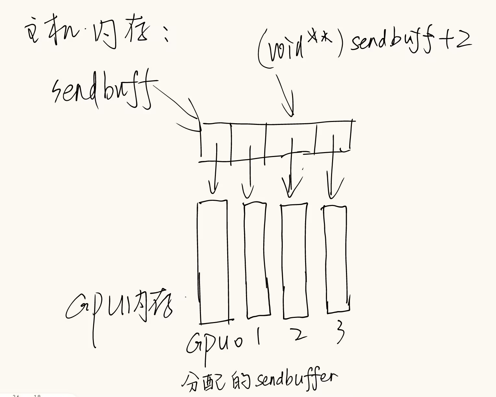

# NCCLCHECK
`NCCLCHECK` 是一个宏，用于简化 NCCL 函数调用后的错误检查。在 NCCL 和许多 C/C++ 编程环境中，错误处理通常是一个关键部分，而通过宏封装可以使代码更加简洁和易于维护。

---

## **NCCLCHECK 的典型定义**
在 NCCL 的代码中，`NCCLCHECK` 通常是定义为类似下面的宏：

```c
#define NCCLCHECK(call) do { \
  ncclResult_t result = call; \
  if (result != ncclSuccess) { \
    printf("NCCL error at %s:%d: %s\n", __FILE__, __LINE__, ncclGetErrorString(result)); \
    return result; \
  } \
} while(0)
```

## **功能**
1. **执行函数调用并捕获返回值**  
   `call` 是需要执行的 NCCL 函数，比如 `ncclInit()` 或 `PtrCheck(out, "GetUniqueId", "out")`。这些函数通常返回一个类型为 `ncclResult_t` 的结果，用于指示是否成功。

2. **检查返回值是否成功**  
   如果 `call` 返回的值不是 `ncclSuccess`，则表示调用失败。

3. **打印调试信息**  
   如果失败，宏会打印文件名、行号以及错误字符串。`ncclGetErrorString` 是 NCCL 提供的函数，可以将错误码转换为可读的错误消息。

4. **中止当前流程**  
   如果函数调用失败，`NCCLCHECK` 通常会返回错误码，退出当前函数。

---

## **使用示例**
在代码中，`NCCLCHECK` 的作用是捕获和处理 NCCL 函数的错误。例如：
```c
NCCLCHECK(ncclInit());
```

等价于：
```c
{
  ncclResult_t result = ncclInit();
  if (result != ncclSuccess) {
    printf("NCCL error at %s:%d: %s\n", __FILE__, __LINE__, ncclGetErrorString(result));
    return result;
  }
}
```

---

## **代码中的用途**
在 `ncclGetUniqueId` 函数中，`NCCLCHECK` 用来确保：
1. **NCCL 初始化成功：**
   ```c
   NCCLCHECK(ncclInit());
   ```
   如果 `ncclInit()` 返回错误码，函数将立即返回错误。

2. **指针有效性检查：**
   ```c
   NCCLCHECK(PtrCheck(out, "GetUniqueId", "out"));
   ```
   如果 `out` 指针无效或检查失败，函数会打印错误信息并返回。

3. **调用其他 NCCL 函数的结果处理：**
   ```c
   NCCLCHECK(bootstrapGetUniqueId(&handle));
   ```
   如果获取 unique ID 的操作失败，也会立即退出并返回错误。

---

## **总结**
`NCCLCHECK` 是一个宏，用于简化和统一错误处理的逻辑。它的主要功能是：
1. 调用 NCCL 函数并捕获返回值。
2. 检查返回值是否成功。
3. 如果失败，打印调试信息，并退出当前函数。

# cudaSetDevice
```c
cudaError_t cudaSetDevice(int device);
```
* 其实这并不是一个NCCL的函数，而是一个CUDA runtime的API
* 用于设置当前线程的CUDA设备(GPU)
* 就是说，我现在如果调用了cudaSetDevice(1)，那么接下来的CUDA函数调用都会在GPU 1上执行（我在操作1号设备），直到我再次对另一个设备调用cudaSetDevice

# cudaMalloc
```c
cudaError_t cudaMalloc(void** devPtr, size_t size);
```
* 为设备分配内存，这个设备就是之前用cudaSetDevice设置的设备
* devPtr是一个指向指针的指针，指向的指针存的是分配的内存的地址
* 举例：
```c
// allocating and initializing device buffers
float **sendbuff = (float **)malloc(nDev * sizeof(float *));
float **recvbuff = (float **)malloc(nDev * sizeof(float *));
cudaStream_t *s = (cudaStream_t *)malloc(sizeof(cudaStream_t) * nDev);

for (int i = 0; i < nDev; ++i)
{
    CUDACHECK(cudaSetDevice(i));
    CUDACHECK(cudaMalloc((void **)sendbuff + i, size * sizeof(float)));
    CUDACHECK(cudaMalloc((void **)recvbuff + i, size * sizeof(float)));
    CUDACHECK(cudaMemset(sendbuff[i], 1, size * sizeof(float)));
    CUDACHECK(cudaMemset(recvbuff[i], 0, size * sizeof(float)));
    CUDACHECK(cudaStreamCreate(s + i));
}
```

